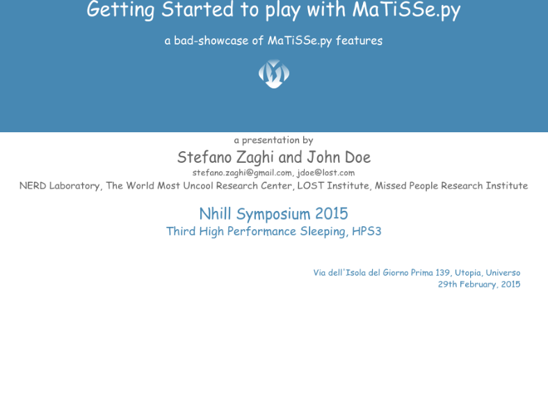
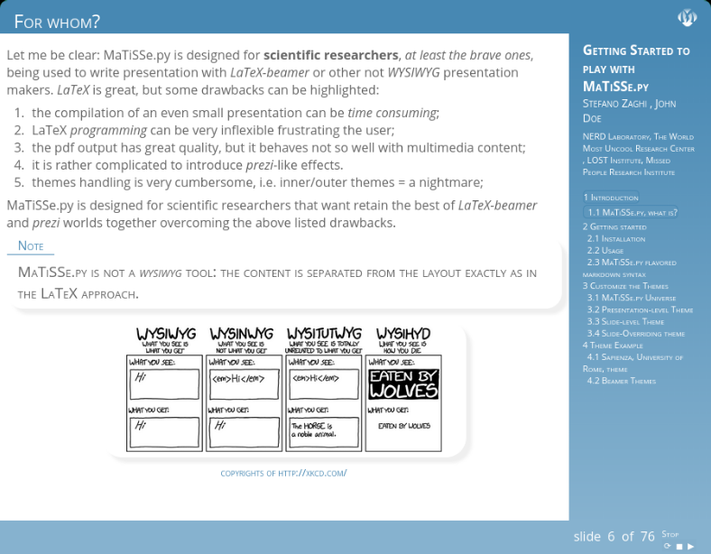
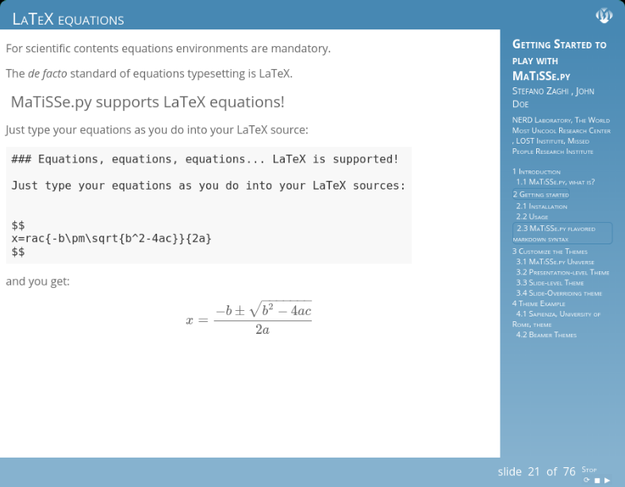
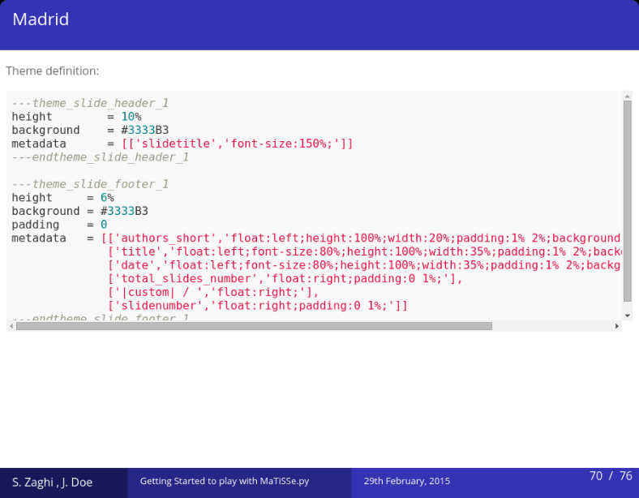

 
# MaTiSSe.py

### MaTiSSe.py, Markdown To Impressive Scientific Slides
MaTiSSe.py is a very simple and stupid (KISS) presentation maker based on simple `markdown` syntax producing high quality first-class html/css presentation with great support for scientific contents.

+ MaTiSSe.py is **NOT** *WYSIWYG*: it converts your sources to high quality html presentation with the same approach of LaTeX typesetting;
+ MaTiSSe.py is tailored to scientific contents (equations, figures, tables, etc...);
+ MaTiSSe.py is a Command Line Tool;
+ MaTiSSe.py is a Free, Open Source Project.

### Status

#### Python support

Requires **Python 3.9+**.

#### Documentation

Install via pip and run with `MaTiSSe.py -i source.md -o output/`. See the [examples/](examples/) directory for sample presentations.

#### A Taste of MaTiSSe.py
See the following screenshots or generate the bundled sample with `MaTiSSe.py --sample mytalk.md`.

##### The Titlepage

##### Figure environment

##### LaTeX Equations support

##### LaTeX-Beamer Themes support

Go to [Top](#top)

## Main Features
MaTiSSe.py has a too much long list of features. Here the main features are listed whereas for a complete list read all the documentation material (examples, wiki, etc...).

* [x] `markdown-to-html` slides maker (with extended markdown syntax);
* [ ] support for structured, long presentations:
    * [x] presentation metadata;
    * [x] presentation sectioning:
        * [x] `titlepage`;
        * [x] `section`;
        * [x] `subsection`;
        * [x] `slide`;
    * [ ] helpers:
        * [x] `TOC`;
        * [x] `countdown timer`;
        * [ ] `navigation controls`;
* [x] easy theming:
    * [x] `canvas`;
    * [x] `headings` (h1,h2,...);
    * [x] global slide theme as well theme of a specific slide (local slide theme):
        * [x] `headers` (unlimited number);
        * [x] `footers` (unlimited number);
        * [x] `left and right sidebars` (unlimited number);
        * [x] `content`;
    * [x] `beamer-like-styles` support;
* [x] `latex equations` support;
* [x] `scientific contents` support:
    * [x] `boxes` with fully customizable environment;
    * [x] `figures` with fully customizable environment;
    * [ ] `tables` with fully customizable environment;
    * [x] `notes` with fully customizable environment;
    * [x] `code listings` with syntax highlighting;
    * [x] `columns` fully customizable environment;
* [ ] `note handouts` support;
* [x] `impress.js` support;
* [ ] `jmpress.js` support;
* [ ] `reveal.js` support;

## Copyrights
MaTiSSe.py is an open source project, it is distributed under the [GPL v3](https://www.gnu.org/licenses/gpl-3.0.html) license. A copy of the license should be distributed within MaTiSSe.py. Anyone interested to use, develop or to contribute to MaTiSSe.py is welcome. Take a look at the [contributing guidelines](CONTRIBUTING.md) for starting to contribute to the project.

Go to [Top](#top)
